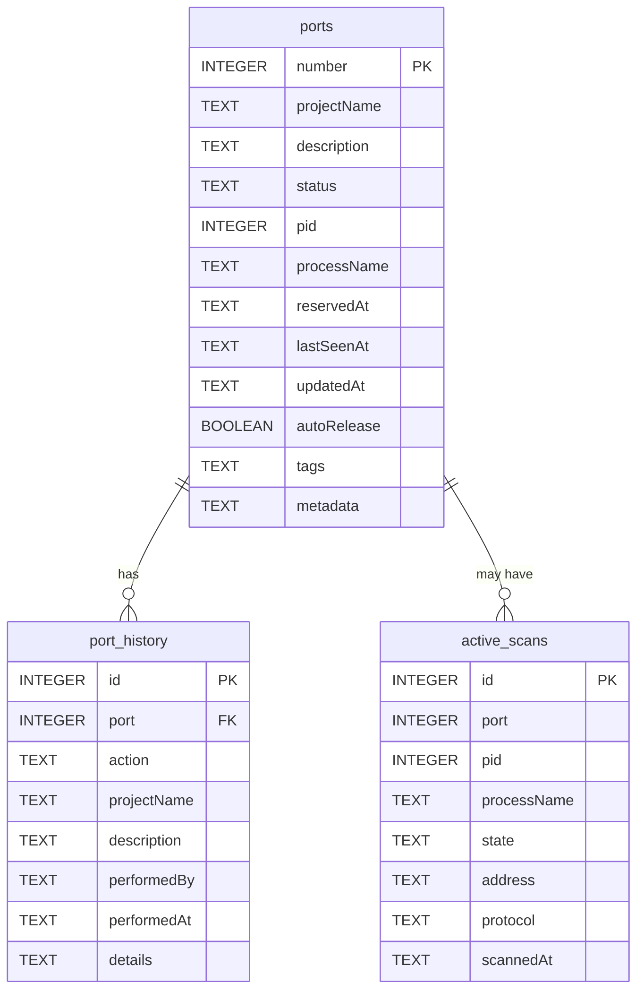

# Database Schema

Port Keeper uses SQLite for data storage. This document describes the database structure and relationships.

## 📊 Database Overview

### Location
- **Default Path**: `~/.portkeeper/database.db`
- **Format**: SQLite 3
- **Encoding**: UTF-8
- **Journal Mode**: WAL (Write-Ahead Logging)

## 🗄️ Tables

### ports

The main table storing port information.

```sql
CREATE TABLE ports (
    number INTEGER PRIMARY KEY,
    projectName TEXT NOT NULL,
    description TEXT,
    status TEXT NOT NULL CHECK (status IN ('reserved', 'in-use', 'free')),
    pid INTEGER,
    processName TEXT,
    reservedAt TEXT NOT NULL DEFAULT (datetime('now')),
    lastSeenAt TEXT,
    updatedAt TEXT NOT NULL DEFAULT (datetime('now')),
    autoRelease BOOLEAN DEFAULT 0,
    tags TEXT,
    metadata TEXT
);

-- Indexes for performance
CREATE INDEX idx_ports_status ON ports(status);
CREATE INDEX idx_ports_project ON ports(projectName);
CREATE INDEX idx_ports_reserved_at ON ports(reservedAt);
CREATE INDEX idx_ports_tags ON ports(tags);
```

### port_history

Tracks historical changes to ports.

```sql
CREATE TABLE port_history (
    id INTEGER PRIMARY KEY AUTOINCREMENT,
    port INTEGER NOT NULL,
    action TEXT NOT NULL CHECK (action IN ('reserved', 'released', 'in-use', 'killed')),
    projectName TEXT,
    description TEXT,
    performedBy TEXT,
    performedAt TEXT NOT NULL DEFAULT (datetime('now')),
    details TEXT,
    FOREIGN KEY (port) REFERENCES ports(number)
);

CREATE INDEX idx_history_port ON port_history(port);
CREATE INDEX idx_history_action ON port_history(action);
CREATE INDEX idx_history_date ON port_history(performedAt);
```

### active_scans

Stores results from port scans.

```sql
CREATE TABLE active_scans (
    id INTEGER PRIMARY KEY AUTOINCREMENT,
    port INTEGER NOT NULL,
    pid INTEGER,
    processName TEXT,
    state TEXT,
    address TEXT,
    protocol TEXT DEFAULT 'tcp',
    scannedAt TEXT NOT NULL DEFAULT (datetime('now')),
    UNIQUE(port, pid)
);

CREATE INDEX idx_scans_port ON active_scans(port);
CREATE INDEX idx_scans_pid ON active_scans(pid);
CREATE INDEX idx_scans_date ON active_scans(scannedAt);
```

### configurations

Stores exported/imported configurations.

```sql
CREATE TABLE configurations (
    id INTEGER PRIMARY KEY AUTOINCREMENT,
    name TEXT NOT NULL,
    description TEXT,
    data TEXT NOT NULL,
    version TEXT NOT NULL,
    createdAt TEXT NOT NULL DEFAULT (datetime('now')),
    createdBy TEXT,
    checksum TEXT
);

CREATE INDEX idx_config_name ON configurations(name);
CREATE INDEX idx_config_created ON configurations(createdAt);
```

### migrations

Tracks database schema versions.

```sql
CREATE TABLE migrations (
    id INTEGER PRIMARY KEY,
    version TEXT NOT NULL UNIQUE,
    description TEXT,
    appliedAt TEXT NOT NULL DEFAULT (datetime('now')),
    checksum TEXT
);
```

## 🔗 Relationships



## 📝 Field Descriptions

### ports Table

| Field | Type | Description | Example |
|-------|------|-------------|---------|
| number | INTEGER | Port number (1-65535) | 3000 |
| projectName | TEXT | Project identifier | "my-app" |
| description | TEXT | Port usage description | "React dev server" |
| status | TEXT | Current port status | "reserved", "in-use", "free" |
| pid | INTEGER | Process ID if active | 12345 |
| processName | TEXT | Process name if active | "node" |
| reservedAt | TEXT | ISO 8601 timestamp | "2024-01-20T10:30:00Z" |
| lastSeenAt | TEXT | Last active scan timestamp | "2024-01-20T10:35:00Z" |
| updatedAt | TEXT | Last modification timestamp | "2024-01-20T10:30:00Z" |
| autoRelease | BOOLEAN | Auto-release on process exit | 0 or 1 |
| tags | TEXT | JSON array of tags | '["frontend","react","dev"]' |
| metadata | TEXT | JSON object for custom data | '{"team":"alpha","env":"dev"}' |

### Status Values

- **free**: Port is available for reservation
- **reserved**: Port is reserved but not actively in use
- **in-use**: Port is reserved and has an active process

## 🔍 Common Queries

### Get All Reserved Ports
```sql
SELECT 
    number,
    projectName,
    description,
    reservedAt,
    tags
FROM ports 
WHERE status IN ('reserved', 'in-use')
ORDER BY number;
```

### Find Ports by Project
```sql
SELECT * FROM ports 
WHERE projectName = 'my-app' 
ORDER BY number;
```

### Get Port History
```sql
SELECT 
    h.action,
    h.performedAt,
    h.projectName,
    h.description,
    h.details
FROM port_history h
WHERE h.port = 3000
ORDER BY h.performedAt DESC;
```

### Find Stale Reservations
```sql
SELECT 
    number,
    projectName,
    reservedAt,
    julianday('now') - julianday(reservedAt) as days_old
FROM ports
WHERE status = 'reserved'
  AND julianday('now') - julianday(reservedAt) > 30
ORDER BY days_old DESC;
```

### Active Port Summary
```sql
SELECT 
    p.number,
    p.projectName,
    p.status,
    s.pid,
    s.processName,
    s.state
FROM ports p
LEFT JOIN active_scans s ON p.number = s.port
WHERE p.status = 'in-use'
ORDER BY p.number;
```

## 🔄 Triggers

### Update Timestamp Trigger
```sql
CREATE TRIGGER update_ports_timestamp 
AFTER UPDATE ON ports
BEGIN
    UPDATE ports 
    SET updatedAt = datetime('now') 
    WHERE number = NEW.number;
END;
```

### History Tracking Trigger
```sql
CREATE TRIGGER track_port_changes
AFTER UPDATE ON ports
WHEN OLD.status != NEW.status
BEGIN
    INSERT INTO port_history (
        port, action, projectName, 
        description, performedAt
    ) VALUES (
        NEW.number,
        CASE 
            WHEN NEW.status = 'reserved' THEN 'reserved'
            WHEN NEW.status = 'in-use' THEN 'in-use'
            WHEN NEW.status = 'free' THEN 'released'
        END,
        NEW.projectName,
        NEW.description,
        datetime('now')
    );
END;
```

## 📊 Views

### v_port_summary
```sql
CREATE VIEW v_port_summary AS
SELECT 
    COUNT(CASE WHEN status = 'reserved' THEN 1 END) as reserved_count,
    COUNT(CASE WHEN status = 'in-use' THEN 1 END) as in_use_count,
    COUNT(CASE WHEN status = 'free' THEN 1 END) as free_count,
    COUNT(*) as total_count
FROM ports;
```

### v_project_ports
```sql
CREATE VIEW v_project_ports AS
SELECT 
    projectName,
    GROUP_CONCAT(number) as ports,
    COUNT(*) as port_count,
    SUM(CASE WHEN status = 'in-use' THEN 1 ELSE 0 END) as active_count
FROM ports
WHERE status != 'free'
GROUP BY projectName;
```

## 🛠️ Maintenance

### Vacuum Database
```sql
VACUUM;
ANALYZE;
```

### Clean Old History
```sql
DELETE FROM port_history 
WHERE julianday('now') - julianday(performedAt) > 365;

DELETE FROM active_scans 
WHERE julianday('now') - julianday(scannedAt) > 7;
```

### Integrity Check
```sql
PRAGMA integrity_check;
PRAGMA foreign_key_check;
```

## 💾 Backup and Restore

### Backup Database
```bash
# Simple backup
cp ~/.portkeeper/database.db ~/.portkeeper/backup-$(date +%Y%m%d).db

# SQL dump
sqlite3 ~/.portkeeper/database.db .dump > backup.sql

# With Port Keeper
portman export full-backup.json
```

### Restore Database
```bash
# From file backup
cp backup.db ~/.portkeeper/database.db

# From SQL dump
sqlite3 ~/.portkeeper/database.db < backup.sql

# With Port Keeper
portman import full-backup.json --replace
```

## 🔒 Security Considerations

1. **File Permissions**: Database should be readable/writable by user only
   ```bash
   chmod 600 ~/.portkeeper/database.db
   ```

2. **SQL Injection**: All queries use parameterized statements

3. **Data Validation**: Check constraints ensure data integrity

4. **Audit Trail**: port_history table tracks all changes

## 🚀 Performance Optimization

### Index Usage
- Primary key on port number for fast lookups
- Indexes on commonly queried fields
- Composite indexes for complex queries

### Query Optimization
```sql
-- Use EXPLAIN QUERY PLAN to analyze
EXPLAIN QUERY PLAN
SELECT * FROM ports WHERE projectName = 'my-app';
```

### Database Statistics
```sql
-- Update statistics
ANALYZE;

-- Check database size
SELECT page_count * page_size / 1024.0 / 1024.0 as size_mb 
FROM pragma_page_count(), pragma_page_size();
```

## 📈 Future Schema Enhancements

Planned additions for future versions:

1. **Teams Table**: Multi-user support
2. **Schedules Table**: Automated port management
3. **Metrics Table**: Usage statistics
4. **Webhooks Table**: Integration notifications
5. **Rules Table**: Port allocation rules

---

For database-related issues, see the [Troubleshooting Guide](Troubleshooting#database-issues).